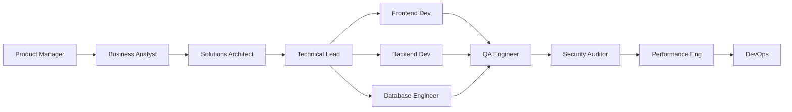

# BMAD Specialized Agents
## Attelia Dental - Enterprise Satın Alma Yönetim Platformu

**Version:** 1.0
**Date:** 2025-11-05
**Total Agents:** 12

---

## Agent Architecture

The BMAD-METHOD employs specialized AI agents that work collaboratively to handle different aspects of the software development lifecycle. Each agent has specific expertise and responsibilities.

```
┌─────────────────────────────────────────────────────────────┐
│                     BMAD Agent Network                       │
│                                                              │
│  ┌──────────────────────┐    ┌──────────────────────┐      │
│  │   Strategy Layer     │    │   Planning Layer     │      │
│  │  - Product Manager   │    │  - Technical Lead    │      │
│  │  - Business Analyst  │    │  - Solutions Arch    │      │
│  └──────────────────────┘    └──────────────────────┘      │
│                                                              │
│  ┌──────────────────────┐    ┌──────────────────────┐      │
│  │  Development Layer   │    │   Quality Layer      │      │
│  │  - Frontend Dev      │    │  - QA Engineer       │      │
│  │  - Backend Dev       │    │  - Security Auditor  │      │
│  │  - Database Eng      │    │  - Performance Eng   │      │
│  └──────────────────────┘    └──────────────────────┘      │
│                                                              │
│  ┌──────────────────────┐    ┌──────────────────────┐      │
│  │   Support Layer      │    │   DevOps Layer       │      │
│  │  - UX Designer       │    │  - DevOps Engineer   │      │
│  │  - Tech Writer       │    │  - SRE Specialist    │      │
│  └──────────────────────┘    └──────────────────────┘      │
└─────────────────────────────────────────────────────────────┘
```

---

## Agent Definitions

### 1. Product Manager Agent

**Role:** Product Strategy & Requirements

**Responsibilities:**
- Define product vision and strategy
- Gather and prioritize requirements
- Create user stories and acceptance criteria
- Define success metrics and KPIs
- Stakeholder communication

**Key Outputs:**
- Product Requirements Document (PRD)
- User stories with acceptance criteria
- Feature prioritization matrix
- Success metrics definition
- Roadmap updates

**Expertise Areas:**
- Business domain knowledge
- User journey mapping
- Competitive analysis
- Market research
- Stakeholder management

**Interaction:**
```
→ Receives: Business goals, user feedback
→ Produces: PRD, user stories, priorities
→ Collaborates with: Business Analyst, UX Designer, Technical Lead
```

---

### 2. Business Analyst Agent

**Role:** Business Logic & Process Design

**Responsibilities:**
- Analyze business processes
- Define business rules and logic
- Create workflow diagrams
- Document edge cases
- Validate requirements feasibility

**Key Outputs:**
- Business process models
- Workflow diagrams
- Business rules documentation
- Use case scenarios
- Process optimization recommendations

**Expertise Areas:**
- Purchase approval workflows
- Budget management logic
- Multi-tenant business rules
- Role-based access patterns
- Compliance requirements

**Interaction:**
```
→ Receives: PRD, business requirements
→ Produces: Process models, business rules
→ Collaborates with: Product Manager, Solutions Architect
```

---

### 3. Solutions Architect Agent

**Role:** System Architecture & Design

**Responsibilities:**
- Design system architecture
- Define technical stack
- Create architecture diagrams
- Design database schema
- Plan scalability strategy

**Key Outputs:**
- Technical architecture document
- System architecture diagrams
- Database schema design
- API design specifications
- Integration patterns

**Expertise Areas:**
- Multi-tenant architecture
- Microservices design
- Database design (PostgreSQL)
- API design (REST/GraphQL)
- Security architecture

**Interaction:**
```
→ Receives: PRD, technical requirements
→ Produces: Architecture docs, design diagrams
→ Collaborates with: Technical Lead, Database Engineer, DevOps
```

---

### 4. Technical Lead Agent

**Role:** Technical Direction & Code Quality

**Responsibilities:**
- Define technical standards
- Code review and quality assurance
- Technology selection
- Technical debt management
- Team technical guidance

**Key Outputs:**
- Coding standards document
- Technology stack recommendations
- Code review guidelines
- Technical debt backlog
- Architecture decision records

**Expertise Areas:**
- Next.js 14 best practices
- TypeScript patterns
- React optimization
- Code quality metrics
- Technical leadership

**Interaction:**
```
→ Receives: Architecture design, team feedback
→ Produces: Standards, guidelines, decisions
→ Collaborates with: All development agents, Solutions Architect
```

---

### 5. Frontend Developer Agent

**Role:** User Interface Implementation

**Responsibilities:**
- Implement React components
- Build responsive layouts
- Integrate with APIs
- Optimize frontend performance
- Implement state management

**Key Outputs:**
- React components (TypeScript)
- Tailwind CSS styling
- Frontend routing (App Router)
- Client-side validation
- Responsive designs

**Expertise Areas:**
- React 18 & Next.js 14
- TypeScript
- Tailwind CSS
- State management (Context API)
- Performance optimization

**Technologies:**
```typescript
// Stack expertise
- Next.js 14 (App Router)
- React 18 (Server/Client Components)
- TypeScript 5+
- Tailwind CSS
- Lucide Icons
- Recharts (data viz)
```

**Interaction:**
```
→ Receives: UI designs, component specs
→ Produces: React components, pages
→ Collaborates with: UX Designer, Backend Developer, QA
```

---

### 6. Backend Developer Agent

**Role:** API & Business Logic Implementation

**Responsibilities:**
- Implement API endpoints
- Business logic implementation
- Data validation
- Authentication & authorization
- Third-party integrations

**Key Outputs:**
- API route handlers
- Business logic services
- Validation schemas (Zod)
- Authentication middleware
- Integration adapters

**Expertise Areas:**
- Next.js API Routes
- Prisma ORM
- JWT authentication
- RESTful API design
- Business logic patterns

**Technologies:**
```typescript
// Stack expertise
- Next.js API Routes
- Prisma ORM
- Zod validation
- JWT (jsonwebtoken)
- bcrypt (password hashing)
```

**Interaction:**
```
→ Receives: API specs, business rules
→ Produces: API endpoints, services
→ Collaborates with: Frontend Dev, Database Engineer, Security
```

---

### 7. Database Engineer Agent

**Role:** Database Design & Optimization

**Responsibilities:**
- Design database schema
- Create migrations
- Optimize queries
- Implement indexing strategy
- Data integrity enforcement

**Key Outputs:**
- Prisma schema
- Database migrations
- Query optimization
- Indexing strategy
- Seed data scripts

**Expertise Areas:**
- PostgreSQL 14+
- Prisma ORM
- Database normalization
- Indexing strategies
- Query optimization

**Technologies:**
```sql
-- Stack expertise
- PostgreSQL 14+
- Prisma Schema Language
- SQL optimization
- Database indexing
- Transactions & ACID
```

**Interaction:**
```
→ Receives: Data models, performance requirements
→ Produces: Schema, migrations, optimizations
→ Collaborates with: Solutions Architect, Backend Dev
```

---

### 8. UX Designer Agent

**Role:** User Experience Design

**Responsibilities:**
- Design user interfaces
- Create user flows
- Wireframe key pages
- Ensure accessibility
- Define design system

**Key Outputs:**
- UI mockups and wireframes
- User flow diagrams
- Component design system
- Accessibility guidelines
- Interaction patterns

**Expertise Areas:**
- UI/UX best practices
- Accessibility (WCAG)
- Design systems
- User research
- Interaction design

**Design Principles:**
```
1. Clarity: Clear information hierarchy
2. Efficiency: Minimal clicks to goals
3. Consistency: Unified design language
4. Feedback: Clear action results
5. Accessibility: WCAG 2.1 AA
```

**Interaction:**
```
→ Receives: User stories, personas
→ Produces: Designs, flows, prototypes
→ Collaborates with: Product Manager, Frontend Dev
```

---

### 9. QA Engineer Agent

**Role:** Quality Assurance & Testing

**Responsibilities:**
- Define test strategies
- Write test cases
- Implement automated tests
- Perform integration testing
- Bug tracking and reporting

**Key Outputs:**
- Test plan document
- Unit test suites
- Integration tests
- E2E test scenarios
- Bug reports

**Expertise Areas:**
- Testing strategies
- Jest/Vitest
- React Testing Library
- Playwright/Cypress
- API testing

**Testing Pyramid:**
```
        ┌─────────┐
        │   E2E   │ (10%)
        ├─────────┤
        │ Integr  │ (20%)
        ├─────────┤
        │  Unit   │ (70%)
        └─────────┘
```

**Interaction:**
```
→ Receives: Requirements, implementations
→ Produces: Tests, test reports, bug reports
→ Collaborates with: All development agents, Technical Lead
```

---

### 10. Security Auditor Agent

**Role:** Security & Compliance

**Responsibilities:**
- Security code review
- Vulnerability assessment
- Compliance checking
- Security best practices
- Penetration testing guidance

**Key Outputs:**
- Security audit reports
- Vulnerability assessments
- Compliance checklists
- Security recommendations
- Threat model documents

**Expertise Areas:**
- OWASP Top 10
- JWT security
- SQL injection prevention
- XSS/CSRF protection
- GDPR/KVKK compliance

**Security Checklist:**
```
✓ Authentication security (JWT, bcrypt)
✓ Authorization (RBAC)
✓ Input validation (Zod)
✓ SQL injection prevention (Prisma)
✓ XSS protection
✓ CSRF protection
✓ Secure headers
✓ Rate limiting
✓ Data encryption
✓ Multi-tenant isolation
```

**Interaction:**
```
→ Receives: Code, architecture
→ Produces: Security reports, recommendations
→ Collaborates with: Backend Dev, DevOps, Technical Lead
```

---

### 11. DevOps Engineer Agent

**Role:** Deployment & Infrastructure

**Responsibilities:**
- CI/CD pipeline setup
- Infrastructure as code
- Deployment automation
- Environment management
- Backup and recovery

**Key Outputs:**
- CI/CD workflows
- Docker configurations
- Deployment scripts
- Infrastructure configs
- Monitoring setup

**Expertise Areas:**
- Docker & containers
- GitHub Actions
- Vercel deployment
- AWS/Azure infrastructure
- Database migrations

**CI/CD Pipeline:**
```yaml
# GitHub Actions
stages:
  - Lint & Type Check
  - Unit Tests
  - Build Application
  - Integration Tests
  - Deploy to Staging
  - Smoke Tests
  - Deploy to Production
```

**Interaction:**
```
→ Receives: Application code, infra requirements
→ Produces: Pipelines, configs, deployments
→ Collaborates with: Technical Lead, SRE, Database Engineer
```

---

### 12. Performance Engineer Agent

**Role:** Performance Optimization

**Responsibilities:**
- Performance profiling
- Optimization recommendations
- Load testing
- Database query optimization
- Caching strategy

**Key Outputs:**
- Performance audit reports
- Optimization recommendations
- Load test results
- Caching strategies
- Performance benchmarks

**Expertise Areas:**
- Frontend performance (Core Web Vitals)
- Backend optimization
- Database query tuning
- Caching strategies (Redis)
- CDN configuration

**Performance Targets:**
```
- Page Load: <2s (desktop), <3s (mobile)
- API Response: <500ms (p95)
- Time to Interactive (TTI): <3s
- First Contentful Paint (FCP): <1.5s
- Largest Contentful Paint (LCP): <2.5s
```

**Interaction:**
```
→ Receives: Application, performance metrics
→ Produces: Optimization reports, benchmarks
→ Collaborates with: Frontend Dev, Backend Dev, Database Engineer
```

---

## Agent Collaboration Workflows

### Feature Development Workflow



### Code Review Workflow

```
1. Developer commits code
2. Technical Lead: Code quality review
3. Security Auditor: Security review
4. Performance Engineer: Performance review
5. QA Engineer: Test coverage review
6. Approval & merge
```

### Deployment Workflow

```
1. QA Engineer: Final test validation
2. Security Auditor: Security scan
3. DevOps Engineer: Deploy to staging
4. Performance Engineer: Load testing
5. Product Manager: UAT approval
6. DevOps Engineer: Production deployment
7. SRE: Monitoring & alerting
```

---

## Agent Communication Protocol

### Information Flow

**Upstream:** Strategy → Planning → Development → Quality
**Downstream:** Quality → Development → Planning → Strategy

### Feedback Loops

```
Product Manager ←→ Business Analyst
Solutions Architect ←→ Technical Lead
Frontend Dev ←→ Backend Dev
QA Engineer ←→ All Development Agents
Security Auditor ←→ Backend Dev
Performance Eng ←→ All Development Agents
```

---

## Agent Activation Guidelines

### When to Activate Each Agent

**Planning Phase:**
- Product Manager (required)
- Business Analyst (required)
- Solutions Architect (required)
- UX Designer (required)
- Technical Lead (required)

**Implementation Phase:**
- Frontend Developer (per feature)
- Backend Developer (per feature)
- Database Engineer (schema changes)
- QA Engineer (ongoing)

**Quality Assurance Phase:**
- QA Engineer (required)
- Security Auditor (required)
- Performance Engineer (required)

**Deployment Phase:**
- DevOps Engineer (required)
- Technical Lead (oversight)

---

## Appendix

### Agent Skill Matrix

| Agent | Strategy | Design | Development | Testing | Operations |
|-------|----------|--------|-------------|---------|------------|
| Product Manager | ⭐⭐⭐⭐⭐ | ⭐⭐ | - | - | - |
| Business Analyst | ⭐⭐⭐⭐ | ⭐⭐⭐ | - | - | - |
| Solutions Architect | ⭐⭐⭐ | ⭐⭐⭐⭐⭐ | ⭐⭐ | - | ⭐⭐ |
| Technical Lead | ⭐⭐ | ⭐⭐⭐⭐ | ⭐⭐⭐⭐⭐ | ⭐⭐⭐ | ⭐⭐ |
| Frontend Dev | - | ⭐⭐ | ⭐⭐⭐⭐⭐ | ⭐⭐ | - |
| Backend Dev | - | - | ⭐⭐⭐⭐⭐ | ⭐⭐ | - |
| Database Engineer | - | ⭐⭐⭐ | ⭐⭐⭐⭐⭐ | ⭐⭐ | ⭐⭐ |
| UX Designer | ⭐⭐ | ⭐⭐⭐⭐⭐ | - | - | - |
| QA Engineer | - | - | ⭐⭐ | ⭐⭐⭐⭐⭐ | - |
| Security Auditor | ⭐⭐ | ⭐⭐ | ⭐⭐⭐ | ⭐⭐⭐⭐⭐ | ⭐⭐⭐ |
| DevOps Engineer | - | ⭐⭐ | ⭐⭐ | ⭐⭐ | ⭐⭐⭐⭐⭐ |
| Performance Eng | - | ⭐⭐ | ⭐⭐⭐ | ⭐⭐⭐⭐ | ⭐⭐⭐ |

---

**Document Status:** ✅ Active
**Last Updated:** 2025-11-05
**Next Review:** 2025-12-05
