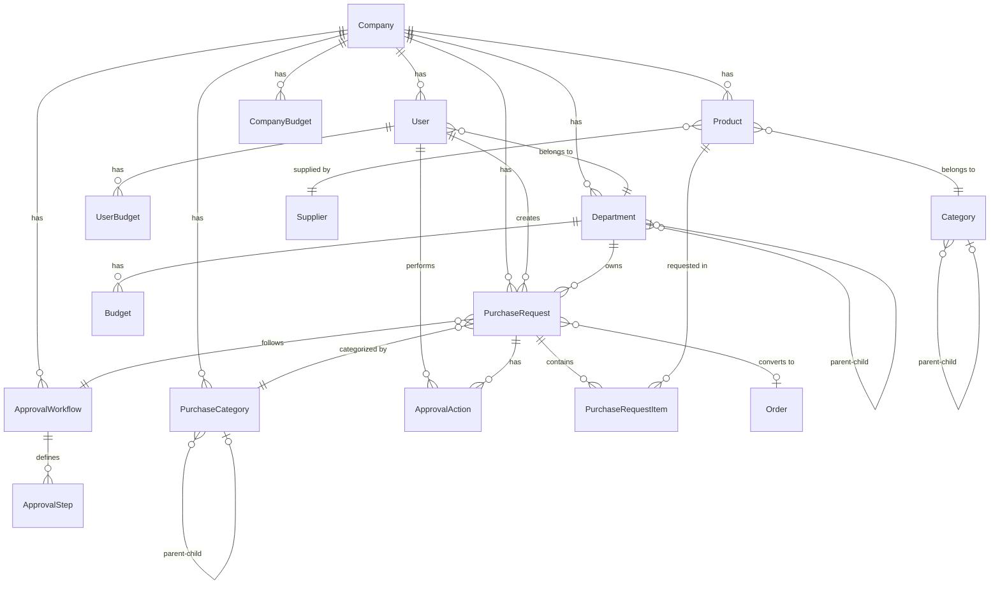

# Technical Architecture Document
## Attelia Dental - Enterprise Satın Alma Yönetim Platformu

**Version:** 1.0
**Date:** 2025-11-05
**Status:** Active
**Architecture Type:** Monolithic → Modular (Migration Path to Microservices)

---

## Table of Contents
1. [System Overview](#system-overview)
2. [Architecture Principles](#architecture-principles)
3. [Technology Stack](#technology-stack)
4. [System Architecture](#system-architecture)
5. [Data Architecture](#data-architecture)
6. [API Architecture](#api-architecture)
7. [Security Architecture](#security-architecture)
8. [Deployment Architecture](#deployment-architecture)
9. [Scalability & Performance](#scalability--performance)
10. [Monitoring & Observability](#monitoring--observability)

---

## System Overview

### High-Level Architecture

```
┌─────────────────────────────────────────────────────────────┐
│                        Client Layer                          │
│  ┌──────────────┐  ┌──────────────┐  ┌──────────────┐      │
│  │   Browser    │  │ Mobile (TBD) │  │   Admin UI   │      │
│  └──────────────┘  └──────────────┘  └──────────────┘      │
└─────────────────────────────────────────────────────────────┘
                           ↓ HTTPS
┌─────────────────────────────────────────────────────────────┐
│                    Application Layer                         │
│  ┌──────────────────────────────────────────────────────┐   │
│  │              Next.js 14 (App Router)                 │   │
│  │  ┌────────────────┐    ┌─────────────────────────┐  │   │
│  │  │  Frontend SSR  │    │   API Routes (Backend)  │  │   │
│  │  │   React 18     │    │    - REST Endpoints     │  │   │
│  │  └────────────────┘    │    - Middleware         │  │   │
│  │                        │    - Business Logic     │  │   │
│  │                        └─────────────────────────┘  │   │
│  └──────────────────────────────────────────────────────┘   │
└─────────────────────────────────────────────────────────────┘
                           ↓
┌─────────────────────────────────────────────────────────────┐
│                       Data Layer                             │
│  ┌──────────────────────────────────────────────────────┐   │
│  │                   Prisma ORM                         │   │
│  │         (Type-safe Database Access Layer)            │   │
│  └──────────────────────────────────────────────────────┘   │
│                           ↓                                  │
│  ┌──────────────────────────────────────────────────────┐   │
│  │              PostgreSQL 14+ Database                 │   │
│  │    - Multi-tenant data isolation                     │   │
│  │    - ACID transactions                               │   │
│  │    - Advanced indexing                               │   │
│  └──────────────────────────────────────────────────────┘   │
└─────────────────────────────────────────────────────────────┘
```

---

## Architecture Principles

### 1. SOLID Principles
- **Single Responsibility:** Each module has one reason to change
- **Open/Closed:** Open for extension, closed for modification
- **Liskov Substitution:** Interfaces over implementations
- **Interface Segregation:** Many specific interfaces vs one general
- **Dependency Inversion:** Depend on abstractions

### 2. Multi-Tenancy Pattern
- **Data Isolation:** Company-scoped queries (discriminator column)
- **Security First:** All API routes validate companyId
- **Tenant Context:** Request-scoped tenant identification
- **Shared Schema:** Single database, partitioned by companyId

### 3. Domain-Driven Design (DDD)
```
Core Domains:
├── Identity & Access Management (IAM)
├── Budget Management
├── Purchase Request Management
├── Approval Workflow Engine
├── Product Catalog Management
└── Reporting & Analytics

Supporting Domains:
├── Notification Service
├── Audit Logging
└── File Management

Generic Domains:
├── User Management
└── Settings Management
```

### 4. Design Patterns Used

**Creational:**
- Factory Pattern (Workflow creation)
- Singleton Pattern (Database connection)

**Structural:**
- Repository Pattern (Data access)
- Adapter Pattern (External integrations)
- Decorator Pattern (Middleware chains)

**Behavioral:**
- Strategy Pattern (Approval strategies)
- State Machine (Request lifecycle)
- Observer Pattern (Notifications)
- Chain of Responsibility (Approval chain)

---

## Technology Stack

### Frontend
| Technology | Version | Purpose |
|------------|---------|---------|
| Next.js | 14.2+ | Full-stack React framework |
| React | 18.3+ | UI library |
| TypeScript | 5.4+ | Type safety |
| Tailwind CSS | 3.4+ | Utility-first CSS |
| Lucide Icons | 0.263+ | Icon library |
| Recharts | 3.3+ | Data visualization |

### Backend
| Technology | Version | Purpose |
|------------|---------|---------|
| Next.js API Routes | 14.2+ | RESTful API |
| Prisma ORM | 5.11+ | Database ORM |
| Zod | 3.22+ | Schema validation |
| bcryptjs | 2.4+ | Password hashing |
| jsonwebtoken | 9.0+ | JWT authentication |

### Database
| Technology | Version | Purpose |
|------------|---------|---------|
| PostgreSQL | 14+ | Primary database |
| Prisma Migrate | 5.11+ | Schema migrations |
| Prisma Studio | 5.11+ | Database GUI |

### DevOps (Planned)
| Technology | Purpose |
|------------|---------|
| Docker | Containerization |
| GitHub Actions | CI/CD |
| Vercel | Hosting (dev/staging) |
| AWS/Azure | Production hosting |
| Redis | Caching layer |

---

## System Architecture

### Application Layers

```
┌───────────────────────────────────────────────────────────┐
│                    Presentation Layer                      │
│  - Next.js Pages (app/ directory)                         │
│  - React Components (components/)                         │
│  - UI State Management (contexts/)                        │
│  - Client-side validation                                 │
└───────────────────────────────────────────────────────────┘
                          ↓
┌───────────────────────────────────────────────────────────┐
│                   Application Layer                        │
│  - API Route Handlers (app/api/)                          │
│  - Request validation (Zod schemas)                       │
│  - Authentication middleware                              │
│  - Authorization logic                                    │
│  - Business logic orchestration                           │
└───────────────────────────────────────────────────────────┘
                          ↓
┌───────────────────────────────────────────────────────────┐
│                     Domain Layer                           │
│  - Business entities (types/)                             │
│  - Domain services (lib/)                                 │
│  - Business rules & validation                            │
│  - Workflow engines                                       │
└───────────────────────────────────────────────────────────┘
                          ↓
┌───────────────────────────────────────────────────────────┐
│                  Data Access Layer                         │
│  - Prisma Client (lib/prisma.ts)                          │
│  - Repository pattern implementations                     │
│  - Database queries                                       │
│  - Transaction management                                 │
└───────────────────────────────────────────────────────────┘
                          ↓
┌───────────────────────────────────────────────────────────┐
│                  Infrastructure Layer                      │
│  - PostgreSQL Database                                    │
│  - File storage (future)                                  │
│  - Email service (future)                                 │
│  - Cache service (future)                                 │
└───────────────────────────────────────────────────────────┘
```

### Module Structure

```
Sat-nAlmaCozumleri/
├── app/                              # Next.js App Router
│   ├── (auth)/                       # Auth routes group
│   │   └── login/
│   ├── (dashboard)/                  # Dashboard routes group
│   │   ├── dashboard/
│   │   ├── products/
│   │   ├── cart/
│   │   ├── requests/
│   │   └── reports/
│   ├── admin/                        # Admin routes
│   │   ├── users/
│   │   ├── departments/
│   │   ├── products/
│   │   ├── categories/
│   │   ├── suppliers/
│   │   └── workflows/
│   ├── api/                          # API Routes
│   │   ├── auth/
│   │   ├── purchase-requests/
│   │   ├── departments/
│   │   ├── products/
│   │   ├── reports/
│   │   └── ...
│   ├── layout.tsx
│   └── page.tsx
│
├── components/                       # Shared React components
│   ├── ui/                          # Base UI components
│   ├── forms/                       # Form components
│   ├── layouts/                     # Layout components
│   └── ...
│
├── lib/                              # Shared utilities
│   ├── prisma.ts                    # Prisma client singleton
│   ├── auth.ts                      # Auth utilities
│   ├── api.ts                       # API client
│   └── utils.ts                     # Helper functions
│
├── contexts/                         # React contexts
│   ├── AuthContext.tsx
│   └── NotificationContext.tsx
│
├── types/                            # TypeScript types
│   └── index.ts
│
├── prisma/                           # Database
│   ├── schema.prisma                # Prisma schema
│   ├── migrations/                  # Migration history
│   └── seed.ts                      # Seed data
│
└── bmad/                             # BMAD-METHOD
    ├── planning/                     # Planning docs
    ├── agents/                       # AI agents
    ├── workflows/                    # Workflow definitions
    └── _cfg/                         # Configuration
```

---

## Data Architecture

### Entity Relationship Diagram



### Multi-Tenant Data Model

**Tenant Isolation Strategy:**
```sql
-- All queries automatically filtered by companyId
SELECT * FROM users WHERE companyId = $tenantId;

-- Enforced at Prisma level
prisma.user.findMany({
  where: { companyId: ctx.user.companyId }
})
```

**Key Tables:**

#### Core Multi-Tenant Tables
1. **Company** - Root tenant entity
2. **User** - Company-scoped users
3. **Department** - Company-scoped departments
4. **Product** - Company-scoped products
5. **PurchaseRequest** - Company-scoped requests

#### Budget Management (3-Tier)
```
CompanyBudget (Tier 1)
    └─> Assigned to Company

Budget (Tier 2)
    └─> Assigned to Department

UserBudget (Tier 3)
    └─> Assigned to Individual User
```

#### Approval Workflow
```
ApprovalWorkflow
    └─> ApprovalStep (ordered, 0-based)
        └─> ApprovalAction (performed by users)
```

### Database Indexing Strategy

**Primary Indexes:**
```sql
-- Multi-tenancy indexes
CREATE INDEX idx_users_companyId ON users(companyId);
CREATE INDEX idx_departments_companyId ON departments(companyId);
CREATE INDEX idx_products_companyId ON products(companyId);

-- Lookup indexes
CREATE INDEX idx_users_email ON users(email);
CREATE INDEX idx_products_sku ON products(sku);
CREATE UNIQUE INDEX idx_users_email_company ON users(email, companyId);

-- Foreign key indexes
CREATE INDEX idx_users_departmentId ON users(departmentId);
CREATE INDEX idx_purchaseRequests_requesterId ON purchase_requests(requesterId);
CREATE INDEX idx_purchaseRequests_departmentId ON purchase_requests(departmentId);

-- Status indexes
CREATE INDEX idx_purchaseRequests_status ON purchase_requests(status);
CREATE INDEX idx_products_isActive ON products(isActive);
CREATE INDEX idx_workflows_isActive ON approval_workflows(isActive);

-- Temporal indexes
CREATE INDEX idx_budgets_year ON budgets(year);
CREATE INDEX idx_purchaseRequests_createdAt ON purchase_requests(createdAt);
```

**Query Optimization:**
- All list queries paginated (default: 50 items)
- Use of `select` and `include` for field optimization
- Avoid N+1 queries (include related data)
- Use database transactions for multi-step operations

---

## API Architecture

### REST API Design

**Base URL Pattern:**
```
/api/{resource}/{id?}/{action?}
```

**Endpoint Structure:**

#### Authentication
```
POST   /api/auth/register     # User registration
POST   /api/auth/login        # User login
POST   /api/auth/logout       # User logout
GET    /api/auth/me           # Current user info
```

#### Purchase Requests
```
GET    /api/purchase-requests              # List (filtered by role)
POST   /api/purchase-requests              # Create new request
GET    /api/purchase-requests/:id          # Get single request
PUT    /api/purchase-requests/:id          # Update request
DELETE /api/purchase-requests/:id          # Delete request (draft only)
POST   /api/purchase-requests/:id/approve  # Approve/Reject action
POST   /api/purchase-requests/:id/submit   # Submit for approval
```

#### Departments
```
GET    /api/departments        # List departments (company-scoped)
POST   /api/departments        # Create department (Admin)
GET    /api/departments/:id    # Get department details
PUT    /api/departments/:id    # Update department (Admin)
DELETE /api/departments/:id    # Delete department (Admin)
```

#### Products
```
GET    /api/products           # List products (paginated, filtered)
POST   /api/products           # Create product (Admin)
GET    /api/products/:slug     # Get product details
PUT    /api/products/:id       # Update product (Admin)
DELETE /api/products/:id       # Delete product (Admin)
```

#### Reports
```
GET    /api/reports/purchase-summary        # Purchase analytics
GET    /api/reports/budget                  # Budget utilization
GET    /api/reports/approval-performance    # Approval metrics
```

#### Users
```
GET    /api/users              # List users (Admin)
POST   /api/users              # Create user (Admin)
GET    /api/users/:id          # Get user details
PUT    /api/users/:id          # Update user
DELETE /api/users/:id          # Delete user (Admin)
```

#### Workflows
```
GET    /api/workflows          # List workflows
POST   /api/workflows          # Create workflow (Admin)
GET    /api/workflows/:id      # Get workflow details
PUT    /api/workflows/:id      # Update workflow (Admin)
DELETE /api/workflows/:id      # Delete workflow (Admin)
```

### Request/Response Format

**Standard Request Headers:**
```http
Content-Type: application/json
Authorization: Bearer <JWT_TOKEN>
X-Company-ID: <company_id>  (optional, derived from JWT)
```

**Success Response:**
```json
{
  "success": true,
  "data": { ... },
  "message": "Operation successful"
}
```

**Error Response:**
```json
{
  "success": false,
  "error": {
    "code": "VALIDATION_ERROR",
    "message": "Invalid input data",
    "details": [
      { "field": "email", "message": "Invalid email format" }
    ]
  }
}
```

**Pagination Response:**
```json
{
  "success": true,
  "data": [ ... ],
  "pagination": {
    "page": 1,
    "limit": 50,
    "total": 250,
    "totalPages": 5,
    "hasMore": true
  }
}
```

### Authentication Flow

```
┌────────┐                                          ┌────────┐
│ Client │                                          │ Server │
└───┬────┘                                          └───┬────┘
    │                                                   │
    │ POST /api/auth/login                             │
    │ { email, password }                              │
    ├──────────────────────────────────────────────────>│
    │                                                   │
    │                                      Validate credentials
    │                                      Generate JWT token
    │                                                   │
    │ { success: true, token, user }                   │
    │<──────────────────────────────────────────────────┤
    │                                                   │
    │ Store token in localStorage/cookies              │
    │                                                   │
    │ Subsequent requests                              │
    │ Authorization: Bearer <token>                    │
    ├──────────────────────────────────────────────────>│
    │                                                   │
    │                                      Verify JWT
    │                                      Extract user context
    │                                      Check permissions
    │                                                   │
    │ Response with data                               │
    │<──────────────────────────────────────────────────┤
    │                                                   │
```

**JWT Payload:**
```json
{
  "userId": "cuid",
  "email": "user@example.com",
  "companyId": "company-cuid",
  "role": "DEPARTMENT_MANAGER",
  "iat": 1699200000,
  "exp": 1699286400
}
```

### Middleware Chain

```typescript
// API route execution flow
Request
  ↓
CORS Middleware
  ↓
Rate Limiter (future)
  ↓
Authentication Middleware
  ↓
Company Context Middleware
  ↓
Authorization Middleware (role check)
  ↓
Request Validation (Zod)
  ↓
Business Logic Handler
  ↓
Response Serialization
  ↓
Error Handler
  ↓
Response
```

---

## Security Architecture

### Authentication & Authorization

**Authentication Strategy:**
- JWT-based stateless authentication
- Token expiration: 24 hours
- Refresh token mechanism (future)
- Password hashing: bcrypt (10 rounds)

**Authorization Levels:**
```typescript
enum AuthorizationLevel {
  PUBLIC,          // No auth required
  AUTHENTICATED,   // Any logged-in user
  ROLE_BASED,      // Specific role required
  RESOURCE_OWNER,  // Owner or admin
  COMPANY_ADMIN,   // Company admin or higher
  SUPER_ADMIN      // Platform admin only
}
```

**Permission Matrix:**

| Action | Employee | Dept Mgr | Proc Mgr | Finance Mgr | Company Admin | Super Admin |
|--------|----------|----------|----------|-------------|---------------|-------------|
| Create Request | ✓ | ✓ | ✓ | ✓ | ✓ | ✓ |
| View Own Requests | ✓ | ✓ | ✓ | ✓ | ✓ | ✓ |
| View Dept Requests | - | ✓ | ✓ | ✓ | ✓ | ✓ |
| View All Requests | - | - | ✓ | ✓ | ✓ | ✓ |
| Approve (Dept) | - | ✓ | - | - | ✓ | ✓ |
| Approve (Proc) | - | - | ✓ | - | ✓ | ✓ |
| Approve (Finance) | - | - | - | ✓ | ✓ | ✓ |
| Manage Users | - | - | - | - | ✓ | ✓ |
| Manage Workflows | - | - | - | - | ✓ | ✓ |
| System Config | - | - | - | - | - | ✓ |

### Data Security

**Multi-Tenant Isolation:**
```typescript
// Automatic company filtering
async function getUserCompanyData(userId: string, companyId: string) {
  const user = await prisma.user.findFirst({
    where: {
      id: userId,
      companyId: companyId  // Always filter by companyId
    }
  });

  if (!user) {
    throw new Error('Unauthorized: User not in company');
  }

  return user;
}
```

**SQL Injection Prevention:**
- Prisma ORM parameterized queries
- No raw SQL (except for optimized reports)
- Input validation with Zod schemas

**XSS Prevention:**
- React auto-escaping
- Content Security Policy headers
- Sanitize user-generated content

**CSRF Protection:**
- SameSite cookies
- CSRF tokens for state-changing operations
- Double-submit cookie pattern

### Sensitive Data Handling

**Password Storage:**
```typescript
// Never store plain-text passwords
const hashedPassword = await bcrypt.hash(password, 10);
```

**Environment Variables:**
```bash
DATABASE_URL="postgresql://..."   # Database connection
JWT_SECRET="random-secret-key"    # JWT signing key
NEXTAUTH_SECRET="auth-secret"     # NextAuth secret
```

**Secrets Management (Production):**
- AWS Secrets Manager / Azure Key Vault
- Environment-specific secrets
- Automatic rotation (future)

---

## Deployment Architecture

### Development Environment
```
┌─────────────────────────────────────────┐
│          Developer Machine              │
│                                         │
│  ┌──────────────────────────────────┐  │
│  │  Next.js Dev Server (port 3000)  │  │
│  └──────────────────────────────────┘  │
│                 ↓                       │
│  ┌──────────────────────────────────┐  │
│  │  PostgreSQL (local/Docker)       │  │
│  └──────────────────────────────────┘  │
└─────────────────────────────────────────┘
```

### Staging Environment (Vercel)
```
┌─────────────────────────────────────────┐
│            Vercel Platform              │
│                                         │
│  ┌──────────────────────────────────┐  │
│  │  Next.js App (Serverless)        │  │
│  │  - Auto-scaling                  │  │
│  │  - Edge functions                │  │
│  └──────────────────────────────────┘  │
│                 ↓                       │
│  ┌──────────────────────────────────┐  │
│  │  Vercel Postgres / Supabase      │  │
│  └──────────────────────────────────┘  │
└─────────────────────────────────────────┘
```

### Production Environment (AWS/Azure)
```
                    ┌──────────────┐
                    │   Route 53   │
                    │   (DNS)      │
                    └──────┬───────┘
                           ↓
                    ┌──────────────┐
                    │  CloudFront  │
                    │    (CDN)     │
                    └──────┬───────┘
                           ↓
┌──────────────────────────────────────────────────────┐
│                   Load Balancer                      │
└──────────────────────────────────────────────────────┘
         ↓                    ↓                    ↓
┌─────────────────┐  ┌─────────────────┐  ┌─────────────────┐
│  ECS Container  │  │  ECS Container  │  │  ECS Container  │
│   (Next.js)     │  │   (Next.js)     │  │   (Next.js)     │
└─────────────────┘  └─────────────────┘  └─────────────────┘
         │                    │                    │
         └────────────────────┴────────────────────┘
                           ↓
              ┌────────────────────────┐
              │   RDS PostgreSQL       │
              │   (Multi-AZ)           │
              └────────────────────────┘
                           ↓
              ┌────────────────────────┐
              │   ElastiCache Redis    │
              │   (Future)             │
              └────────────────────────┘
```

### CI/CD Pipeline

```yaml
# GitHub Actions Workflow
name: Deploy

on:
  push:
    branches: [main]

jobs:
  test:
    - Lint code
    - Run unit tests
    - Run integration tests
    - Type checking

  build:
    - Build Next.js application
    - Build Docker image
    - Push to container registry

  deploy:
    - Deploy to staging (auto)
    - Run smoke tests
    - Deploy to production (manual approval)
```

---

## Scalability & Performance

### Horizontal Scaling Strategy

**Application Tier:**
- Stateless API design (JWT-based)
- Multiple Next.js instances behind load balancer
- Auto-scaling based on CPU/memory metrics

**Database Tier:**
- Read replicas for reporting queries
- Connection pooling (PgBouncer)
- Query caching (Redis)

### Performance Optimizations

**Frontend:**
```typescript
// Code splitting
const AdminPanel = dynamic(() => import('./AdminPanel'));

// Image optimization
import Image from 'next/image';

// ISR (Incremental Static Regeneration)
export const revalidate = 60; // 60 seconds

// Suspense boundaries
<Suspense fallback={<Loading />}>
  <Component />
</Suspense>
```

**Backend:**
```typescript
// Pagination
const products = await prisma.product.findMany({
  take: 50,
  skip: page * 50
});

// Select only needed fields
const users = await prisma.user.findMany({
  select: { id: true, name: true, email: true }
});

// Batch loading
const users = await prisma.user.findMany({
  where: { id: { in: userIds } }
});
```

**Database:**
- Proper indexing on all foreign keys
- Composite indexes for common queries
- Materialized views for complex reports (future)
- Partitioning for large tables (future)

### Caching Strategy (Future)

```typescript
// Redis cache layers
L1: Browser cache (static assets)
L2: CDN cache (Next.js static pages)
L3: Application cache (API responses)
L4: Database cache (query results)

// Example: Product catalog caching
const products = await cache.get('products:company:123');
if (!products) {
  products = await prisma.product.findMany({...});
  await cache.set('products:company:123', products, 300); // 5 min TTL
}
```

---

## Monitoring & Observability

### Logging Strategy

**Log Levels:**
```typescript
enum LogLevel {
  DEBUG,    // Development only
  INFO,     // General information
  WARN,     // Warning conditions
  ERROR,    // Error conditions
  CRITICAL  // Critical failures
}
```

**Structured Logging:**
```typescript
logger.info('Purchase request created', {
  requestId: 'req_123',
  userId: 'user_456',
  companyId: 'company_789',
  amount: 15000,
  timestamp: new Date().toISOString()
});
```

### Metrics & Monitoring (Future)

**Key Metrics:**
- Request rate (requests/second)
- Error rate (5xx errors)
- Response time (p50, p95, p99)
- Database connection pool usage
- Active users (concurrent sessions)

**Health Checks:**
```typescript
// GET /api/health
{
  "status": "healthy",
  "database": "connected",
  "uptime": 86400,
  "version": "1.0.0"
}
```

### Error Tracking

**Error Categories:**
1. Client errors (4xx) - User input issues
2. Server errors (5xx) - Application bugs
3. Database errors - Connection/query issues
4. Third-party errors - External service failures

**Error Reporting (Future):**
- Sentry integration
- Slack/email alerts for critical errors
- Error grouping and deduplication

---

## Appendix

### Database Migration Strategy

```bash
# Create migration
npx prisma migrate dev --name add_user_budget

# Apply migration (production)
npx prisma migrate deploy

# Reset database (development only)
npx prisma migrate reset
```

### API Versioning (Future)

```
/api/v1/purchase-requests
/api/v2/purchase-requests
```

### Technology Upgrade Path

**Current:** Monolithic Next.js application
**Phase 2:** Modular monolith with clear boundaries
**Phase 3:** Microservices architecture

```
Monolith → Modular Monolith → Microservices
├── Auth Service
├── Purchase Service
├── Approval Service
├── Budget Service
├── Product Service
└── Reporting Service
```

---

**Document Status:** ✅ Active
**Last Updated:** 2025-11-05
**Reviewers:** Architecture Team, DevOps Team
**Next Review:** 2025-12-05
